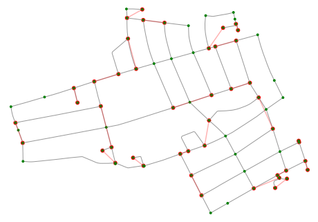
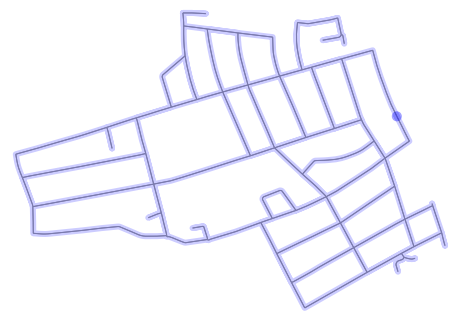
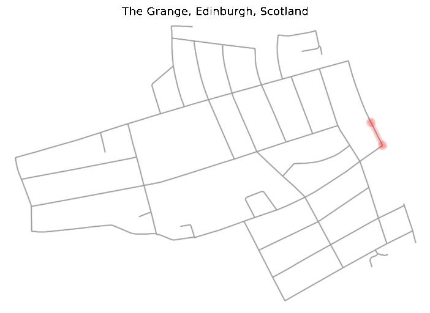

# \#everystreet algorithm

Over the COVID-19 lockdown many runners / cyclist found themselves
captured within their cities. Some of them ended up running / spinning
endless hours on virtual races such as Zwift, but some as e.g. [Mark
Beaumont](https://www.strava.com/athletes/8288853) [1] decided to
join #everystreet challenge. Every street is a challenge originated by
[Rickey Gates](https://www.everysinglestreet.com/why>) [2, 3] (?) who
run _every single street_ in city of San Francisco in fall 2018 which
took him 46 days and run 1,303 miles.

Inspired by Mark Beaumont who did this challenge over the lockdown in
Edinburgh, place where I spend the lockdown, and literally everybody
else who managed to accomplish this challenge. (_I would have never had
the patience and motivation to run that much in the city_) I said to
myself that I am more a mathematician than a runner or cyclist. So, I ask
myself, what is the optimal route? is there any algorithm that can
generate such route?

👉 [See the whole theoritical part](./everystreet_algorithm.pdf)

## Chinese postman problem

Finding a route for #everystreet challenge is basically a well-known
problem of the *chinese postman*, called after Chinese mathematician Kuan
Mei-Ko. (Also known as *Postman Tour* or *Route Inspection Problem*) The
problem is to find the shortest closed path (or circuit) such that
visits every edge of a (closed and undirected) graph.

This solution is strongly inspired by Ruslan Zabrodin algorithm [6] and
Andrew Brooks blog post [5]. For implementing the solution we used
`Networkx` [7], `osmnx` a python package which uses OpenStreetMaps
API [8] and my tiny network package [9].

```python
import networkx as nx
import osmnx as ox
ox.config(use_cache=True, log_console=True)
from tools import *
from graph_route import plot_graph_route
import matplotlib.pyplot as plt
from network import Network
from network.algorithms import hierholzer
```

We used `osmnx` as a source to fetch and plot geographical data. For
example, we choose an Edinburgh neighborhood of the Grange.

```python

location = 'The Grange, Edinburgh, Scotland'
org_graph = ox.graph_from_place(location, network_type='drive')
graph = ox.utils_graph.get_undirected(org_graph)  # for simplification we can use undirected graph
fig, ax = ox.plot_graph(graph, node_zorder=2, node_color='k', bgcolor='w')
```


##Algorithm

In this work, we used algorithm mentioned by Ruslan Zabrodin [6], which
states as follow:  

1.  Select all nodes with odd degree  
2.  Count distance between all odd-degree nodes  
3.  Create a complete weighted graph of all odd-degree nodes, as weights we use distance from step 2.  
4.  Count minimal matching in the complete weighted graph (or maximal matching with inverted weights ``-w``)  
5.  Add matched pairs into original graph   
6.  Find the Eulerian circuit using Hierholzer [10] algorithm  
7.  Sanitize *Eulerian circuit* such that if edge of *matched pair* doesn't exists find closed path connecting *matched pair*

👉 [See the whole theoritical part](./everystreet_algorithm.pdf)

```python
odd_degree_nodes = get_odd_degree_nodes(graph)
pair_weights = get_shortest_distance_for_odd_degrees(graph, odd_degree_nodes)
matched_edges_with_weights = max_matching(pair_weights)
single_edges = get_single_edges(graph)
```
Result of *minimal matching* plotted into original graph (red edges).

```python
fig, ax = plt.subplots(figsize=(8, 8), facecolor='black', frameon=False)
for v, u, w in matched_edges_with_weights:
    x = graph.nodes[v]["x"], graph.nodes[u]["x"]
    y = graph.nodes[v]["y"], graph.nodes[u]["y"]
    ax.plot(x, y, c='red', alpha=0.3)
    ax.scatter(x, y, c='red', edgecolor="none")

fig, ax = ox.plot_graph(graph, node_zorder=2, node_color='g', bgcolor='k', ax=ax)
```





Counting the `final_path` with Hierholzer algorithm and plotting on
map. As we can see all edges were visited.

```python
edges = map_osmnx_edges2integers(graph, single_edges + matched_edges_with_weights)

network = Network(len(graph.nodes), edges, weighted=True)
eulerian_path = hierholzer(network)
converted_eulerian_path = convert_integer_path2osmnx_nodes(eulerian_path, graph.nodes())
double_edge_heap = get_double_edge_heap(graph)

final_path = convert_path(graph, converted_eulerian_path, double_edge_heap)
fig, ax = plot_graph_route(org_graph, final_path, route_linewidth=6, node_size=0, bgcolor='w', route_alpha=0.2, route_color='b')
```




In order to see how the *runner* should accomplish the route on the map,
we created a simple GIF.

```python
for i, e in enumerate(final_path, start=1):
    fig, ax = plot_graph_route(org_graph, final_path[:i], route_linewidth=6, node_size=0, bgcolor='w', route_alpha=0.2)
    ax.set_title(location)
    fig.savefig(f'img_{i}.png', dpi=120, bbox_inches='tight')
```




## Conclusion

In this work, we tried to adapt the *Postman Tour Problem* to the
\#everystreet challenge. Using `OSMnx` package we were able to
demonstrate on real data.

## Addition

As an addition to previous work we managed to implement the problem on
OpenStreetMap which is a real map, represented as directed and weighted
multigraph, while previous works [5] could not manage multi-edges.

## Limitation

The biggest limitation of this work is the speed and performance of the
algorithm. However *Postman Tour Problem* is not NP hard problem we are
dealing algorithms such as Hierholzer's algorithm `O(|E|)`,
Dijkstra's algorithm `Θ(|E| + |V|log(|V|))` and Weighted
maximum matching having `O(|V|^3) [11, 12]`. In addition Python
packages `NetworkX` and `OSMnx` are simply not the fastest :)

Related readings
----------------

-  Brooks Andrew, 2018, "Graph optimization solvers for the Postman
   Problems", https://github.com/brooksandrew/postman\_problems
-  Wen LeaPearn1, C.M.Liu2, 1994, "Algorithms for the Chinese postman
   problem on mixed networks",
   https://kundoc.com/pdf-algorithms-for-the-chinese-postman-problem-on-mixed-networks-.html

References
----------

 [1] Mark Beaumont Strava Profile,
   https://www.strava.com/athletes/8288853  
 [2] Rickey Gates (2019), Every Single Street with Rickey Gates,
   https://www.everysinglestreet.com/why  
[3] Katherine Turner (2019), Every Single Street, Strava stories,
   https://blog.strava.com/every-single-street-17484/  
[4] Reinhard Diestel (2000), Graph Theory, Springer, Volume 173 of
   Graduate texts in mathematics, ISSN 0072-5285  
 [5] Andrew Brooks (2017), Intro to graph optimization: solving the
   Chinese Postman Problem,
   http://brooksandrew.github.io/simpleblog/articles/intro-to-graph-optimization-solving-cpp/  
 [6] Ruslan Zabrodin (2015), Postman Problem,
   https://www-m9.ma.tum.de/graph-algorithms/directed-chinese-postman/index\_en.html  
 [7] NetworkX Developers (2020), "NetworkX is a Python package for the
   creation, manipulation, and study of the structure, dynamics, and
   functions of complex networks.", https://github.com/networkx/networkx  
 [8] Boeing, G. (2017). "OSMnx: New Methods for Acquiring,
   Constructing, Analyzing, and Visualizing Complex Street Networks."
   Computers, Environment and Urban Systems 65, 126-139.
   doi:10.1016/j.compenvurbsys.2017.05.004  
 [9] Matej Kerekrety (2020), "Simple pure Python package for
   generating, modifying and playing with (even complex) networks.",
   https://github.com/matejker/network  
 [10] Ruslan Zabrodin (2015), Algorithmus von Hierholzer,
   https://www-m9.ma.tum.de/graph-algorithms/hierholzer/index\_en.html  
 [11] Galil, Z. (1986). Efficient algorithms for finding maximum
   matching in graphs. ACM Comput. Surv., 18,  
   23-38.https://www.semanticscholar.org/paper/Efficient-algorithms-for-finding-maximum-matching-Galil/ef1b31b4728615a52e3b8084379a4897b8e526ea?p2df  
 [12] Jack Edmonds (2008), "Weighted maximum matching in general
   graphs.",
   http://jorisvr.nl/files/graphmatching/20130407/mwmatching.py
