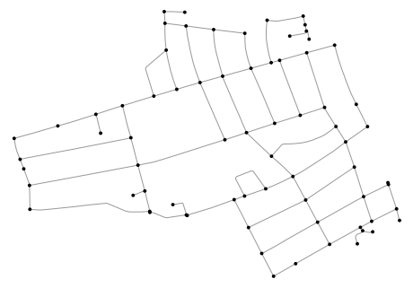
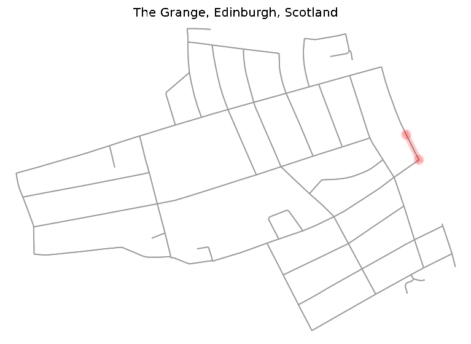

# \#everystreet algorithm

Over the COVID-19 lockdown many runners and cyclist found themselves captured 
within their cities. Some of them ended up running or spinning endless hours 
on virtual races such as Zwift, but some as e.g. Mark Beaumont [1] decided to 
join #everystreet challenge. Every street is a challenge originated by Rickey 
Gates [2, 3] who run _every single street_ in city of San Francisco in fall 2018 
which took him 46 days and run 1,303 miles.

Inspired by Mark Beaumont who did this challenge over the lockdown in Edinburgh, 
place where I spend the lockdown, and literally everyone else who managed to 
accomplish this challenge (_I would have never had the patience and motivation to 
run that much in the city_) 
I said to myself that I am a mathematician and software engineer more then a runner 
or cyclist. So, I ask myself, what is the optimal route? Is there any algorithm 
which can generate such route?

 - For more details see [the theoretical summary](./everystreet_algorithm.pdf)
 - The _app_ itself can be find: [www.everystreetchallenge.com](http://www.everystreetchallenge.com)
 - Jupyter notebook with [The Grange example](./everystreet.ipynb)

## Every street challenge
Rules of every street challenge are run or cycle every single street of given 
(metropolitan) area which is usually a city or a neighborhood. Till this point
the rules are simple and clear, but the problem is the street definition. How 
do we define a street? Do we include pedestrian paths, parks or motorways? For 
simplicity, we consider a street network of edges and nodes (interception of 
two or more edges and dead-end roads) accessible by car*. Assuming that runner 
can run oneway roads in both direction, we do not consider road direction. 
In order to find such network we used Open Street Map API [4].

## Chinese postman problem

Finding a route for #everystreet challenge is basically a well-known
problem of the *chinese postman*, called after Chinese mathematician Kuan
Mei-Ko. (Also known as *Postman Tour* or *Route Inspection Problem*) The
problem is to find the shortest closed path (or circuit) such that
visits every edge of a (closed and undirected) graph.

```python
from libs.tools import *
from libs.graph_route import plot_graph_route

import networkx as nx
import osmnx as ox
import matplotlib.pyplot as plt

from network import Network
from network.algorithms import hierholzer
```

We used `OSMnx` as a source for geographical data. As an example, 
we chose an Edinburgh neighborhood of the Grange. In order to avoid heavy traffic
we specify `OSMnx` query and limit the `highway` selection.

```python
CUSTOM_FILTER = (
    '["highway"]["area"!~"yes"]["highway"!~"bridleway|bus_guideway|bus_stop|construction|'
    'cycleway|elevator|footway|motorway|motorway_junction|motorway_link|escalator|proposed|'
    'construction|platform|raceway|rest_area|path|service"]["access"!~"customers|no|private"]'
    '["public_transport"!~"platform"]["fee"!~"yes"]["foot"!~"no"]["service"!~"drive-through|'
    'driveway|parking_aisle"]["toll"!~"yes"]'
)

location = "The Grange, Edinburgh, Scotland"
org_graph = ox.graph_from_place(location, custom_filter=CUSTOM_FILTER)

""" Simplifying the original directed multi-graph to undirected, so we can go both 
    ways in one way streets """
graph = ox.convert.to_undirected(org_graph)
fig, ax = ox.plot_graph(graph, node_zorder=2, node_color="k", bgcolor="w")
```




## Algorithm

In this work, we used algorithm proposed by Edmonds, J. and Johnson [5], which
states as follow:  

1.  Find all nodes with odd degree  
2.  Calculate the sortest distance between all odd-degree nodes  
3.  Create a complete weighted graph of all odd-degree nodes, as weights we use distances from step 2.  
4.  Find minimal matching in the complete weighted graph
5.  Add matched pairs into original graph   
6.  Find the Eulerian circuit using Hierholzer [10] algorithm  

👉 For more details see [the theoretical summary](./everystreet_algorithm.pdf).

```python
# Finds the odd degree nodes and minimal matching
odd_degree_nodes = get_odd_degree_nodes(graph)
pair_weights = get_shortest_distance_for_odd_degrees(graph, odd_degree_nodes)
matched_edges_with_weights = min_matching(pair_weights)
```
Result of *minimal matching* plotted into original graph (red edges).

```python
fig, ax = plt.subplots(figsize=(8, 8), facecolor='black', frameon=False)
for v, u, w in matched_edges_with_weights:
    x = graph.nodes[v]["x"], graph.nodes[u]["x"]
    y = graph.nodes[v]["y"], graph.nodes[u]["y"]
    ax.plot(x, y, c='red', alpha=0.3)
    ax.scatter(x, y, c='red', edgecolor="none")

fig, ax = ox.plot_graph(graph, node_zorder=2, node_color='g', bgcolor='k', ax=ax)
```


Counting the `final_path` with Hierholzer algorithm and plotting on
map. As we can see all edges were visited.

```python
# List all edges of the extended graph including original edges and edges from minimal matching
single_edges = [(u, v) for u, v, k in graph.edges]
added_edges = get_shortest_paths(graph, matched_edges_with_weights)
edges = map_osmnx_edges2integers(graph, single_edges + added_edges)

# Finds the Eulerian path
network = Network(len(graph.nodes), edges, weighted=True)
eulerian_path = hierholzer(network)
converted_eulerian_path = convert_integer_path2osmnx_nodes(eulerian_path, graph.nodes())
double_edge_heap = get_double_edge_heap(org_graph)

# Finds the final path with edge IDs
final_path = convert_path(graph, converted_eulerian_path, double_edge_heap)

fig, ax = plot_graph_route(org_graph, final_path, route_linewidth=6, node_size=0, bgcolor="w", route_alpha=0.2, route_color="w")```
```


In order to see how the *runner* should accomplish the route on the map,
we created a simple GIF.

```python
for i, e in enumerate(final_path, start=1):
    fig, ax = plot_graph_route(org_graph, final_path[:i], route_linewidth=6, node_size=0, bgcolor="w", route_alpha=0.2)
    ax.set_title(location)
    fig.savefig(f"/img_{i}.png", dpi=120, bbox_inches="tight")
```



If you would like to generate GPX file with the route, follow [Issue #6 (comment)](https://github.com/matejker/everystreet/issues/6#issuecomment-774651380)

## Usage
In order to run it locally you need to install it on Python +3.8:
```bash
pip install -r requirements.txt  # Using pip
poetry install  # or by using Poetry
```

Feel more that free to use, modify and copy the code, just follow the [licence](./LICENSE.txt) and cite it:

```tex
@misc{Kerekrety2020,
  author = {Kerekrety, M},
  title = {#everystreet algorithm},
  year = {2020},
  publisher = {GitHub},
  journal = {GitHub repository},
  howpublished = {\url{https://github.com/matejker/everystreet}}
}
```

## Related readings

-  Brooks Andrew, (2018), _Graph optimization solvers for the Postman Problems_, 
   [https://github.com/brooksandrew/postman_problems](https://github.com/brooksandrew/postman_problems)
-  Wen LeaPearn1, C.M.Liu2, (1994), _Algorithms for the Chinese postman problem on mixed networks_,
   https://kundoc.com/pdf-algorithms-for-the-chinese-postman-problem-on-mixed-networks-.html
-  Andrew Brooks (2017), _Intro to graph optimization: solving the Chinese Postman Problem_
   http://brooksandrew.github.io/simpleblog/articles/intro-to-graph-optimization-solving-cpp/

## References
[1] Beaumont M. (2020), _Strava Profile_, https://www.strava.com/athletes/8288853  
[2] Gates R. (2019), _Every Single Street with Rickey Gates_, https://www.everysinglestreet.com/why  
[3] Turner K. (2019), _Every Single Street, Strava stories_, https://blog.strava.com/every-single-street-17484/  
[4] Open Street Map (2020), http://openstreetmap.org  
[5] Edmonds, J. and Johnson, E.L (1973), _Matching, Euler tours and the Chinese postman. Mathematical Programming 5, 88124_ 
https://doi.org/10.1007/BF01580113  
[6] Bondy J. A. and Murty U. S. R. (1976), _Graph theory with applications_, ISBN 0333177916  
[7] Diestel. R, (2005), _Graph Theory Graduate Texts in Mathematics_, Springer  
[8] Erben, M., (1652), _Knigsberg 1651_, https://en.wikipedia.org/wiki/Knigsberg#/media/File:Image- Koenigsberg, 
Map by Merian-Erben 1652.jpg  
[9] Euler L. (1741), _Commentarii academiae scientiarum Petropolitanae_, Vol- ume 8, pp. 128-140. 
https://scholarlycommons.pacific.edu/euler-works/53/  
[10] Fleischner H. (2016), _Algorithms in Graph Theory_, https://www.dbai.tuwien.ac.at/staff/kronegger/misc/ AlgorithmsInGraphTheory Script.pdf   
[11] Cormen, T. H. (2001), _Introduction to algorithms_, Cambridge, Mass: MIT Press.  
[12] Galil Z. (1986), _Efficient algorithms for finding maximum matching in graphs_, 
https://www.semanticscholar.org/paper/Efficient-algorithms-for- finding-maximum-matching-Galil/ef1b31b4728615a52e3b8084379a4897 b8e526ea   
[13] Edmonds J. (2008), _Weighted maximum matching in general graphs_, 
http://jorisvr.nl/files/graphmatching/20130407/mwmatching.py  
